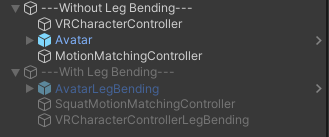
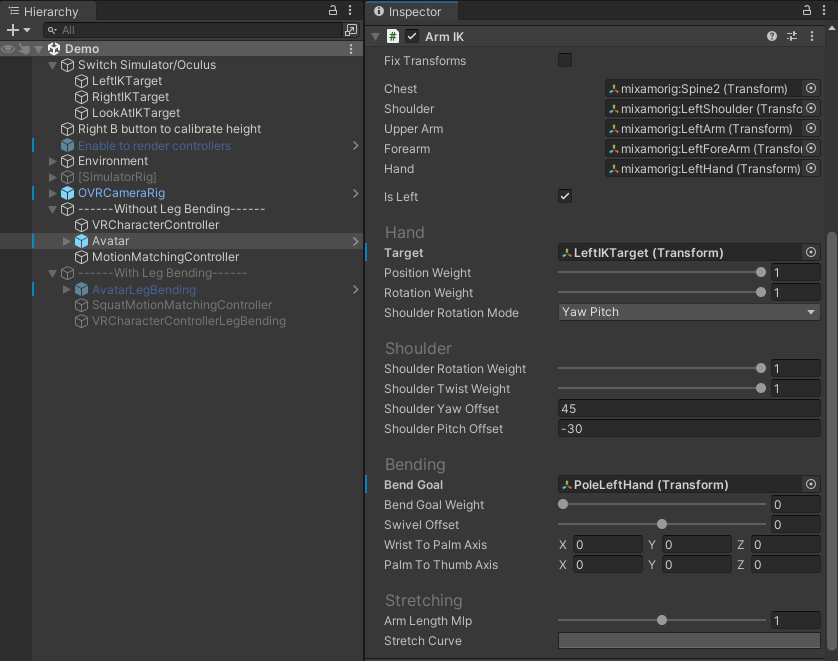
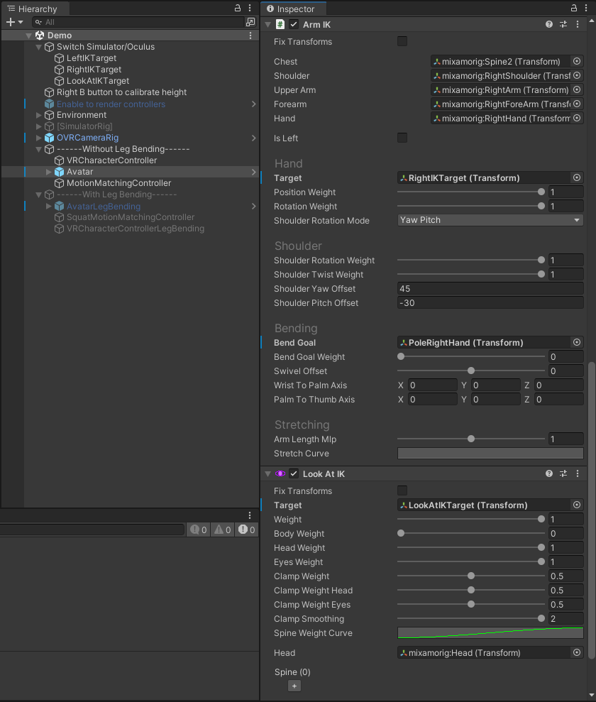

# Combining Motion Matching and Orientation Prediction to Animate Avatars for Consumer-Grade VR Devices

---

<p align="center">
  
</p>

This repository contains the implementation of the method shown in the paper *Combining Motion Matching and Orientation Prediction to Animate Avatars for Consumer-Grade VR Devices* presented at the **21st annual ACM SIGGRAPH / Eurographics Symposium on Computer Animation (SCA 2022)**.

Get an overview of the paper by visiting the [project website](https://upc-virvig.github.io/MMVR/) or watching the [video](https://www.youtube.com/embed/crU9oLX0GnM)!

Download the paper [here](https://doi.org/10.1111/cgf.14628)!

This project is based on my Motion Matching implementation for Unity. If you want to learn more about Motion Matching, you can visit the project [here](https://github.com/JLPM22/MotionMatching).


---

## Contents

1. [Structure](#structure)
2. [Quick Start](#quick-start)
   * [Important Parameters](#important-parameters)
   * [Leg Bending](#leg-bending)
   * [Issues with Final IK](#issues-with-final-ik)
3. [Data](#data)
4. [Training](#training)
5. [Citation](#citation)
6. [License](#license)

## Structure

The project is divided into two folders, ``MMVR`` and ``python``, containing the Unity project and orientation prediction training scripts. Although the neural network is trained using PyTorch, the animation files are preprocessed using Unity before being used for training. Therefore, most of the preprocessing scripts are located inside``MMVR``.

## Quick Start

1. Clone this repository.

2. Install **Unity 2021.2.13f1** (other versions may work but are not tested).

3. Download the processed dataset [here](https://zenodo.org/record/7048601/files/MMData.zip?download=1) and extract it into ``Unity_Project_Path/Assets/MMData``, thus, ``MMData`` folder should contain three folders ``Animations``, ``Data`` and ``Models``.

4. Open the project and navigate to the ``Assets/Scenes`` folder and choose either ``Demo`` (FinalIK required) or ``DemoOnlyHMD``.
   
   > Upper Body inverse kinematics are implemented using [FinalIK](https://assetstore.unity.com/packages/tools/animation/final-ik-14290). Import the assets through the Package Manager window (you will need a valid license from the Unity Asset Store).

5. Use Oculus Link or Air Link to connect your Meta Quest to the PC and press Play in the Unity Editor. 

### Important Parameters

Demo scenes consist of two major GameObjects: VRCharacterController and MotionMatchingController:

VRCharacterController is responsible for creating the trajectories and the direction prediction, some important parameters are: 

- **Use HMD Forward**, which ignores the orientation prediction and uses the HMD forward direction as body direction when set to True.

- **Do Campling**, which enables the position accuracy parameter.

- **Max Distance Simulation Bone** sets the position accuracy (e.g., use *0.3* for high animation quality and *0.1* for accurate body positioning).

MotionMatchingController parameters allow enabling/disabling some features such as inertialize blending or foot lock.

**To obtain a more detailed description of how to use the Motion Matching code of this project, you can visit my [Motion Matching project](https://github.com/JLPM22/MotionMatching), on which this project is based.**

### Leg Bending

To enable leg bending in the demo scene, first disable the GameObject with name *------Without Leg Bending------* and enable the one with name *------With Leg Bending-------*. The main difference lies in the MotionMatchingController, where the latter references the different databases for leg bending.



At run-time, to calibrate the height, press the *B* button in your right controller while standing up. This is an important step to calibrate the Leg Bending.

### Issues with Final IK

Sometimes, depending on the version of Final IK or how the project was imported, the references to Final IK scripts may be lost. In case references are lost, in the GameObject with the name Avatar (AvatarLegBending if using leg bending), there should be 3 scripts from Final IK as in the following pictures:





## Data

The processed data required to execute the project can be downloaded from [here](https://zenodo.org/record/7048601/files/MMData.zip?download=1).

If you wish to download all raw *.bvh* files used for training the orientation prediction network and the motion matching animation database, download [here](https://zenodo.org/record/7048601/files/MMVR_Dataset.zip?download=1) instead.

All motions are recorded by the same actor in different VR systems (Meta Quest and HTC VIVE) while performing different actions (VR applications and video games, and some interaction actions to increase the coverage of the dataset). The file *locomotion_vr.bvh* is used as the animation database for Motion Matching.

## Training

To train with your data, first, take a look at the *MotionSynthesisData* located in the folder ``Assets/MMData/Data``. There are two files named **TestMSData** and **TrainingMSData**. These are Unity ScriptableObjects and contain the *.bvh* and some information to process them (similar to MotionMatchingData) to create the database for training and testing. You can modify these two files with your own animation data and click *Generate Databases* before training the neural network.

Once the databases are created, go to ``python/`` and create a python virtual environment ``python -m venv env`` (or ``python3 -m venv env``), activate it ```./env/Scripts/activate```, and install all dependencies ``pip install -r requirements.txt``. Then, open the script located at ``python/src/train_direction.py``, and modify the paths (lines *43* and *44*) to the training and testing databases. Finally, run the script for training! The resulting model will be saved in ``python/data/``.

## Citation

If you find our research useful, please cite our paper:

```
@article {ponton2022mmvr,
    journal = {Computer Graphics Forum},
    title = {{Combining Motion Matching and Orientation Prediction to Animate Avatars for Consumer-Grade VR Devices}},
    author = {Ponton, Jose Luis and Yun, Haoran and Andujar, Carlos and Pelechano, Nuria},
    year = {2022},
    publisher = {The Eurographics Association and John Wiley & Sons Ltd.},
    ISSN = {1467-8659},
    DOI = {10.1111/cgf.14628}
}
```

## License

This work is licensed under CC BY-NC-SA 4.0.
The project and data is freely available for free non-commercial use, and may be redistributed under these conditions. Please, see the [license](LICENSE) for further details.
